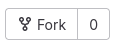
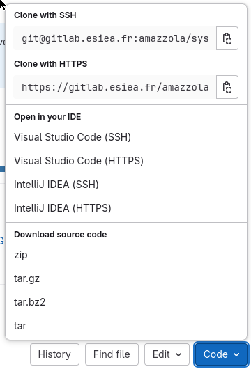

# SYS4041 TPs - Dépôt

## Pour commencer

### Votre équipe 
Equipe n°[num. d'équipe à remplacer] - [Nom d'équipe facultatif]

Membres : 
- [NOM Prénom à remplacer]
- [NOM Prénom à remplacer]
- [NOM Prénom à remplacer]
- [NOM Prénom à remplacer]

### Vos livrables
- votre rapport en PDF ou Markdown (nom du fichier dans le dépôt) : [votre rapport (remplacer le lien)](lien)
- vos vidéos de démonstration (liens YT ou OneDrive) :
	- [vos démos (remplacer le lien)](lien)
	- [vos démos (remplacer le lien)](lien)
	- [vos démos (remplacer le lien)](lien)
	- [vos démos (remplacer le lien)](lien)
	- [vos démos (remplacer le lien)](lien)

##### Note 
En Markdown, vous pouvez taper `[mots](destination du lien)` pour créer un lien.

### Forker et s'approprier le dépôt
Pour commencer, il vous faut fork, c'est-à-dire faire une copie de ce dépôt sur
votre propre GitLab.  Pour ce faire, cliquez sur le bouton "Fork" en haut à
droite de la page GitLab.



Ensuite, vous pourrez cloner **votre** dépôt afin de travailler dessus en
local.  Si ce n'est pas déjà fait, il vous faudra créer et déposer votre clé
publique SSH sur GitLab afin de pouvoir push vos changements.



### Contenu
Ce dépôt contient tout l'environnement, les bibliothèques, et de manière
générale tous les fichiers dont vous aurez besoin pour réaliser ce TP. En
particulier, vous y trouverez :
- le `venv` Python qui contient les bibliothèques nécessaires, qu'il vous faudra sourcer (lire la suite)
- le [sujet](sujet.pdf) du TP qui regroupe toutes les consignes liées au TP et au rendu des livrables
- la [documentation](doc/README.md) des bibliothèques qui ont été développées
  spécifiquement pour ce TP, des liens vers les autres, et de manière générale
  toutes les ressources techniques dont vous pourriez avoir besoin
- des [fichiers source d'exemple](examples/README.md) qui vous permettront de
  mieux comprendre comment employer ces bibliothèques

### Liens et contacts utiles
Voici quelques liens et contacts qui pourront vous être utiles pendant ces 18h de TP :
- l'[Excel](https://etesiea-my.sharepoint.com/:x:/g/personal/amazzola_et_esiea_fr/EZte-qYfU2dErX8BS112o5ABWYN3YkdMIGjJ6FLnf-oOjw) contenant les différentes équipes, leurs membres, et où vous pourrez renseigner votre progrès au fur et à mesure des séances
- mon adresse mail personnelle si vous avez une question ou demande en dehors des heures de TP : `amazzola@et.esiea.fr`
- l'adresse email du support SAV EsieaBot si vous en avez besoin : `sav-esieabot@esiea.fr`

N'hésitez pas à me solliciter en cours : le temps passe vite et je suis là pour ça.

## Mise en place de l'environnement sur votre Esieabot
Avec ces informations en tête, il ne vous reste plus qu'à mettre en place votre
environnement sur l'EsieaBot. Comme précisé plus haut, ce dépot contient un
environnement virtual Python (venv), préparé en avance pour contenir tous (ou
une grande majorité) des paquets dont vous aurez besoin.

Pour ce faire : 
1. Ouvrez une session SSH sur votre EsieaBot (en vous aidant de la
   [documentation](https://esieabot.readthedocs.io/fr/latest/use/console/console.html#se-connecter-a-l-esieabot-sans-fil) si besoin).
2. Commencez par installer les dépendances dont nous aurons besoin pour la suite : 
   ```sudo apt install libatlas-base-dev libgtk-3-0 libcblas-dev python3-dev python3.11-dev python3-opencv libcap-dev libavformat-dev```
3. Clonez **votre** dépôt à partir de l'EsieaBot : `git clone [lien de votre
   dépôt]`. Attention : faites attention à bien être dans votre *home*
   (`/home/pi/`) en lançant cette commande.
4. Maintenant et à chaque fois que vous rouvrirez un nouveau shell sur votre Pi
   avec l'intention de lancer votre code, il vous faut sourcer votre
   environnement :  ```. .venv/bin/activate``` Vous verrez alors apparaître
   `(.venv)` à gauche de votre nom d'utilisateur. Cette étape permet de
   s'assurer que vous utilisez dorénavant le Python et les paquets qui sont
   installés dans l'environnement.
5. ???
6. Profit !!
