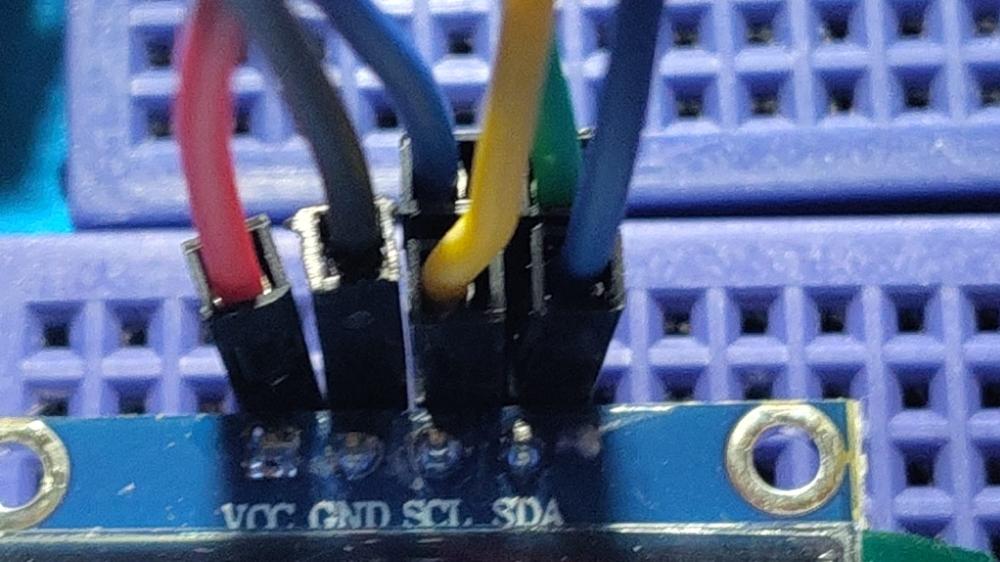
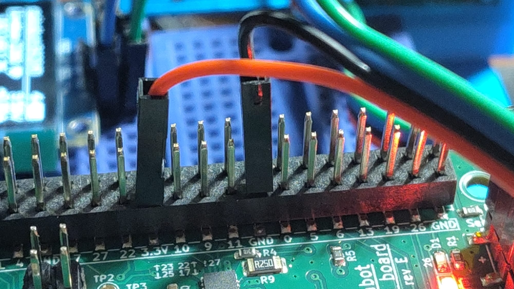
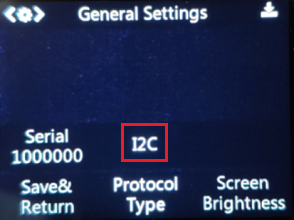

# Installation de la Huskylens

## Câblage
**Attention :** ne brancher la caméra "qu'à froid", c'est-à-dire avec la Raspberry Pi éteinte (par le biais de l'interrupteur sur la Power Board).

La Huskylens dispose d'une interface UART et d'une interface I2C. Pour des raisons de performance, nous utiliserons l'interface I2C. 
L'I2C est une interface série : grâce à cet état de fait, nous pouvons simplement nous brancher sur les lignes SDA et SCL qui partent déjà vers l'écran, un autre périphérique I2C.
Il faut se fier au pinout présent dans la [documentation](https://wiki.dfrobot.com/HUSKYLENS_V1.0_SKU_SEN0305_SEN0336)

## Paramétrage
Une fois les câbles branchés, il faut paramétrer la Huskylens pour qu'elle utilise le bon protocole.

Enfin, il est possible de faire un test qui permet de vérifier que les branchements sont bons et que la Raspberry Pi arrive à communiquer avec la caméra.
Un fichier prévu à cet effet est disponible dans `examples/`.

## Pour aller plus loin
Vous pouvez maintenant vous [familiariser avec la caméra](https://wiki.dfrobot.com/HUSKYLENS_V1.0_SKU_SEN0305_SEN0336) plus amplement.
